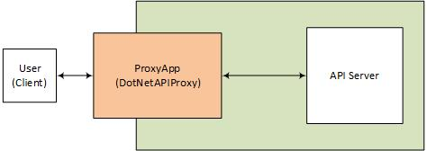

# 🌐 API Proxy Application


## Overview

The API Proxy Application is a middleware solution that allows you to forward requests from clients to backend APIs seamlessly. Built with ASP.NET Core, this application aims to simplify API interactions by providing a unified interface for multiple services.



## ✨ Features

🛡️ Security First

🔒 Domain whitelisting/blacklisting

🚫 SSRF (Server-Side Request Forgery) protection

🔍 Internal IP address blocking

🛡️ Header sanitization and filtering

⚡ Rate limiting ready

⚡ High Performance

🚀 Streaming responses for memory efficiency

📊 Configurable timeout and retry policies

🔄 HttpClient connection pooling

🎯 Async/await pattern throughout

🔧 Easy Configuration

📝 JSON-based configuration

🎨 Flexible routing options

🔌 Pluggable security rules

📈 Comprehensive logging

- Forward HTTP requests (GET, POST, PUT, DELETE)
- Handle authentication for target APIs
- Return responses with appropriate status codes
- Basic logging of requests and responses
- Easy configuration and extensibility

# 🚀 Quick Start
## 1. Installation

```bash
# Clone the repository
git clone https://github.com/fariborzvahid/DotNetAPIProxy.git

# Navigate to project
cd DotNetAPIProxy

# Restore dependencies
dotnet restore

# Run the application
dotnet run

```
## 2. Configuration
Add to your appsettings.json:
```json
{
  "Proxy": {
    "AllowedDomains": [
      "api.example.com",
      "api.trustedsource.com",
      "public-api.company.com"
    ],
    "BlockedDomains": [
      "localhost",
      "127.0.0.1",
      "192.168.*",
      "10.*",
      "172.16.*"
    ],
    "TimeoutSeconds": 30,
    "MaxResponseSizeMB": 100,
    "EnableLogging": true
  },
  "Logging": {
    "LogLevel": {
      "Default": "Information",
      "Microsoft.AspNetCore": "Warning"
    }
  }
}

```
## 3. Basic Usage
🌐 Proxy GET Request
```bash
# Basic syntax
GET /api/proxy/{full-url}

# Example: Proxy to external API
curl https://your-api.com/api/proxy/https://api.example.com/users

# With query parameters
curl "https://your-api.com/api/proxy/https://api.example.com/search?query=tech"
```
 📤 Proxy POST Request

```bash
# POST with JSON body
curl -X POST \
  https://your-api.com/api/proxy/https://api.example.com/users \
  -H "Content-Type: application/json" \
  -d '{"name": "John", "email": "john@example.com"}'

  ```
🔄 Forward Headers
The proxy automatically forwards most headers from the original request:

```bash
# Original headers are forwarded (except security-sensitive ones)
curl https://your-api.com/api/proxy/https://api.example.com/data \
  -H "Authorization: Bearer your-token" \
  -H "X-Custom-Header: custom-value"
  ```
# Prerequisites

- [.NET 10.0 SDK](https://dotnet.microsoft.com/download/dotnet/10.0)
- A code editor (e.g., Visual Studio, Visual Studio Code)
# Installation

1. Clone the repository:
   ```bash
   git clone https://github.com/fariborzvahid/DotNetAPIProxy.git
   cd api-proxy-app
   ```
   
   
# 🎯 Advanced Usage
## 1. Custom Headers
```csharp
// Headers automatically forwarded:
// - Authorization
// - Content-Type
// - Accept
// - User-Agent
// - Custom headers

// Headers filtered out (security):
// - Host
// - Connection
// - Content-Length (handled automatically)
```
## 2. Response Streaming
```bash
# Large files are streamed, not buffered in memory
curl https://your-api.com/api/proxy/https://api.example.com/large-file.zip \
  --output downloaded-file.zip
  ```
## 3. Error Handling
```json
// Success response (200-299)
{
  "data": { /* original response */ },
  "status": 200
}

// Error responses
{
  "error": "Domain not allowed",
  "status": 400
}

// Network errors return 502 Bad Gateway
{
  "error": "Bad Gateway",
  "status": 502
}
```
## ⚙️ Configuration Options

| Setting	| Type | Default | Description
| -----  |:--------:| :---: | -----
|AllowedDomains	| string[]	|[]|	Whitelist of allowed domains
|BlockedDomains	| string[]	| [] |	Blacklist of blocked domains
|TimeoutSeconds	|int |	30| 	Request timeout in seconds
|MaxResponseSizeMB	| int	| 100	| Maximum response size in MB
|EnableLogging | 	bool	| true	| Enable request/response logging
|ForwardHeaders	| bool	| true | 	Forward original request headers


## 🛡️ Security Best Practices
1. Always Use Whitelists
```json
{
  "Proxy": {
    "AllowedDomains": ["trusted-api.yourcompany.com"]
  }
}
```
2. Monitor Usage
```csharp
// Enable detailed logging
services.AddHttpLogging(logging =>
{
    logging.LoggingFields = HttpLoggingFields.All;
});
```
3. Implement Rate Limiting
```csharp
// Add to Program.cs
services.AddRateLimiter(options =>
{
    options.GlobalLimiter = PartitionedRateLimiter.Create<HttpContext, string>(
        context => RateLimitPartition.GetFixedWindowLimiter(
            partitionKey: context.User.Identity?.Name ?? context.Request.Headers.Host.ToString(),
            factory: partition => new FixedWindowRateLimiterOptions
            {
                AutoReplenishment = true,
                PermitLimit = 100,
                QueueLimit = 0,
                Window = TimeSpan.FromMinutes(1)
            }));
});
```

# 📊 Monitoring
Health Check Endpoint
```bash
# Add to Program.cs
app.MapHealthChecks("/health");

# Check proxy health
curl https://your-api.com/health
Log Format
json
{
  "Timestamp": "2024-01-15T10:30:00Z",
  "Level": "Information",
  "Message": "Proxy request completed",
  "Url": "https://api.example.com/data",
  "StatusCode": 200,
  "DurationMs": 150,
  "ClientIp": "192.168.1.100"
}
```

# 🔧 Troubleshooting
 Common Issues
| Issue	| Solution
| ---- | ----
|400: Invalid URL format	|Ensure URL includes http:// or https://
|400: Domain not allowed	|Add domain to AllowedDomains in config
|502: Bad Gateway	|Target service unavailable or timeout
|Timeout errors	|Increase TimeoutSeconds in configuration


Debug Mode
```json
{
  "Logging": {
    "LogLevel": {
      "APIProxy.Controllers.ProxyController": "Debug"
    }
  }
}
```